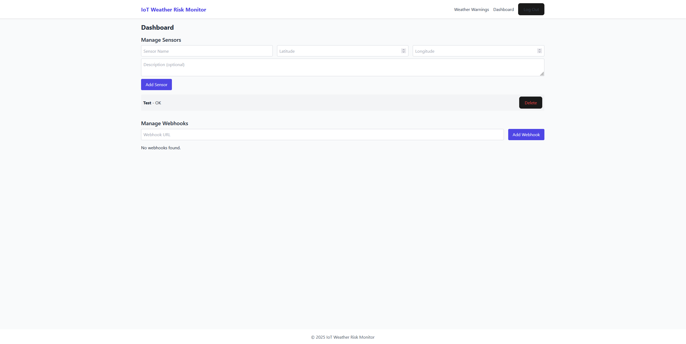
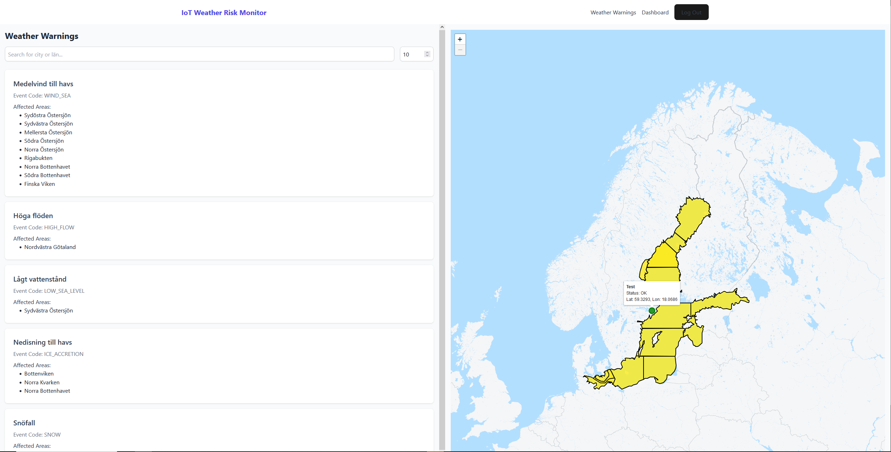

# IoT Weather Risk Monitor

## Overview

IoT Weather Risk Monitor is a real-time weather monitoring system designed to track weather conditions and associated risks using IoT sensors. The system integrates with SMHI's API to fetch weather warnings, manage sensor data, and provide real-time notifications to users via webhooks. This solution aims to minimize potential damages by delivering swift and accurate information, centralizing sensor positions for easier issue resolution.

## Table of Contents

- [Overview](#overview)
- [Features](#features)
- [Technologies Used](#technologies-used)
- [Installation](#installation)
  - [Prerequisites](#prerequisites)
  - [Backend Setup](#backend-setup)
  - [Frontend Setup](#frontend-setup)
- [Usage](#usage)
- [Project Structure](#project-structure)

## Features

- **Real-Time Weather Monitoring:** Continuously fetches and analyzes weather data from SMHI's API.
- **Sensor Management:** Create, update, and delete sensors with geolocation data.
- **User Authentication:** Secure registration and login using JWT.
- **Webhook Notifications:** Configure webhooks to receive real-time alerts based on weather conditions.
- **Interactive Dashboard:** User-friendly React frontend for managing sensors and webhooks.
- **Geographical Visualization:** Visualize sensors and weather warnings on an interactive map using Leaflet.

## Technologies Used

- **Backend:**
  - [Golang](https://golang.org/) for server-side logic
  - [GORM](https://gorm.io/) for ORM and database management
  - [PostgreSQL](https://www.postgresql.org/) as the database
  - [JWT](https://jwt.io/) for authentication
- **Frontend:**
  - [React](https://reactjs.org/) with TypeScript for building the user interface
  - [Axios](https://axios-http.com/) for API requests
  - [Leaflet](https://leafletjs.com/) for map visualization
- **APIs:**
  - [SMHI Open Weather Warnings API](https://opendata.smhi.se/apidocs/)

## Installation

### Prerequisites

- **Backend:**
  - [Go](https://golang.org/doc/install) (version 1.16 or higher)
  - [PostgreSQL](https://www.postgresql.org/download/) (version 12 or higher)
- **Frontend:**
  - [Node.js](https://nodejs.org/en/download/) (version 14 or higher)
  - [npm](https://www.npmjs.com/get-npm) or [Yarn](https://yarnpkg.com/getting-started/install)

### Backend Setup

1. **Clone the Repository:**

       git clone https://github.com/rohnson95/IoTMonitoringApp.git  
       cd your-repo/backend

2. **Install Dependencies:**

       go mod download

3. **Configure Environment Variables:**

   Create a `.env` file in the `backend` directory with the following content:

       DB_HOST=localhost  
       DB_USER=weather_user  
       DB_PASSWORD=weatherpw  
       DB_NAME=weather_iot  
       DB_PORT=5433  
       JWT_SECRET=your_jwt_secret  
       SMHI_API_URL=https://opendata-download-warnings.smhi.se/ibww/api/version/1/warning.json

4. **Run Database Migrations:**

   Ensure PostgreSQL is running and the database is created. Then, run the migrations:

       go run main.go

5. **Start the Backend Server:**

       go run main.go

   The backend server should now be running on `http://localhost:8080`.

### Frontend Setup

1. **Navigate to the Frontend Directory:**
2. **Install Dependencies:**

       npm install  
       or  
       yarn install

3. **Start the Frontend Server:**

       npm start  
       or  
       yarn start

   The frontend application should now be running on `http://localhost:3000`.

## Usage

1. **Register an Account:**

   Visit the registration page on the frontend to create a new account.

2. **Login:**

   Use your credentials to log in to the dashboard.

3. **Manage Sensors:**

   - Add new sensors by providing their name, latitude, longitude, and an optional description.
   - Update or delete existing sensors as needed.

4. **Configure Webhooks:**

   - Set up webhook URLs to receive real-time notifications based on weather alerts.
   - Manage existing webhooks through the dashboard.

5. **View Dashboard:**

   - Monitor your sensors and view real-time weather warnings on an interactive map.
   - Visualize sensor statuses and receive timely notifications for critical weather events.

## Project Structure

    your-repo/  
    ├── backend/  
    │   ├── main.go  
    │   ├── models/  
    │   │   └── models.go  
    │   └── .env  
    ├── frontend/  
    │   ├── src/  
    │   │   ├── components/  
    │   │   ├── utils/  
    │   │   └── App.tsx  
    │   ├── public/  
    │   ├── package.json  
    │   └── .env  
    ├── README.md  
    └── LICENSE

## Screenshots

### Dashboard

### Interactive Map

---
